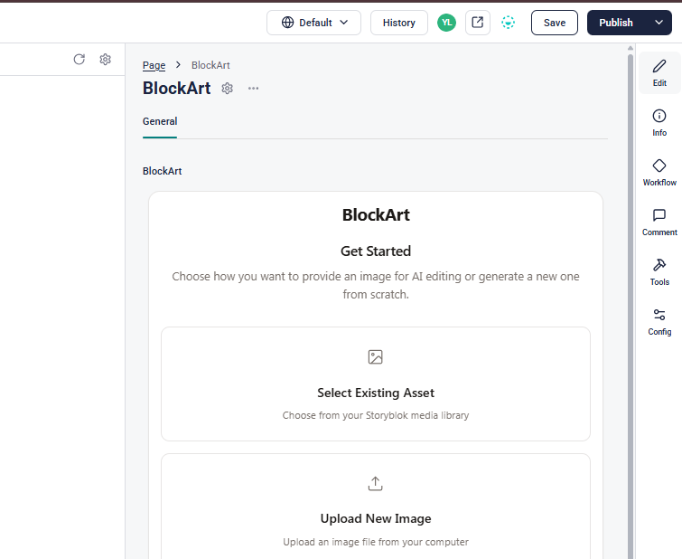

# BlockArt Storyblok Field Plugin

[](https://reactjs.org/)
[](https://www.typescriptlang.org/)
[](https://vitejs.dev/)
[](https://openai.com/)
[](https://www.storyblok.com/)
[](https://pnpm.io/)
[](./LICENSE)

A powerful Storyblok field plugin for AI-powered image editing and asset management.


## Prerequisites

Before getting started, make sure you have the following installed and set up:

- **Node.js** (version 16 or higher)
- **pnpm** package manager
- **Storyblok account** with at least one space
- **Git** for version control
- **OpenAI** account with billing enabled and an API key

## Quick Setup

### Option 1: Direct Plugin Installation (Recommended)

The easiest way to get started is to use our pre-built plugin file:

| Step | Screenshot | Instructions |
|------|------------|--------------|
| 1 |  | Go to **My Plugins** in your Storyblok account and click **New Field-type** |
| 2 |  | Enter a name for your plugin (e.g., "my-blockart-plugin") and click **Save** |
| 3 |  | Copy the contents of [`./build_plugin.js`](https://raw.githubusercontent.com/youneslaaroussi/blockart/refs/heads/main/build_plugin.js) from this repository and paste it into the code editor, then click **Save** and **Publish** |

### Option 2: Build from Source

If you prefer to build the plugin yourself:

1. **Clone the repository:**
   ```bash
   git clone <repository-url>
   cd plugin
   ```

2. **Install dependencies:**
   ```bash
   pnpm install
   ```

3. **Build the project:**
   ```bash
   pnpm run build
   ```

4. **Deploy to Storyblok:**
   ```bash
   npx @storyblok/field-plugin-cli@latest deploy
   ```
   Follow the prompts and connect with your Storyblok account.

## Get your Storyblok Management Token

*Why?* Until we publish this component in the Partner library and enable it to use OAuth, the plugin users must use their own management tokens.

### Generating Your Personal Access Token

| Step | Screenshot | Instructions |
|------|------------|--------------|
| 1 |  | Go to **Account Settings** → **Personal access token** and click **Generate new token** |
| 2 |  | Enter a name for your token, set the expiration period, and click **Generate & Copy token** |

> ⚠️ **Security Warning**: Personal access tokens grant full access to your Storyblok account and all your spaces. Anyone with access to this token can manage your content and settings. Only share this token with trusted team members, and ensure all collaborators in your space understand this security implication. **We plan to migrate to OAuth authentication in the future** to improve security and eliminate the need for sharing personal tokens.

## Step-by-Step Setup Guide

| Step | Screenshot | Instructions |
|------|------------|--------------|
| 1 |  | Open your space, go to Blocks |
| 2 |  | Create a new block |
| 3 |  | Set block_art as technical name, choose **Nestable Block** then click *Add Block* |
| 4 |  | In fields, add a **Plugin** field type with name "blockart" then press *Add* |
| 5 |  | Click on *Save*, then click on the field to edit |
| 6 |  | Set **Custom Type** to **blockart** |
| 8 |  | In **options**, create four key-value pairs. "region", "spaceId", "openaiApiKey", "managementToken". Get your region from Space **general settings.** Click *Save & Back to Fields* |
| 8.5 |  | Click *Save* and close Blocks section. |
| 7 |  | In Page **Edit** section, add a Block |
| 9 |  | Choose *Block Art* |
| 10 |  | Click on the *Block Art* item |
| 11 |  | Enjoy! |

## Usage

Once you've set up the BlockArt plugin, you can start creating and editing images with AI! Here's how to use the powerful features:

| Step | Screenshot | Instructions |
|------|------------|--------------|
| 1 |  | **Choose Your Starting Point**: Select from three options:<br/>• **Select Existing Asset** - Use images from your Storyblok media library<br/>• **Upload New Image** - Upload a fresh image from your computer<br/>• **Generate New Image** - Create entirely new images from text descriptions |
| 2 |  | **Select Editing Mode**: Choose how you want to edit your image:<br/>• **Full Edit** - Apply changes to the entire image (great for style changes, color adjustments, global effects)<br/>• **Inpaint Mode** - Edit only specific areas you select (perfect for object removal, adding elements, selective changes) |
| 3 |  | **Craft Your Prompt**: Describe what you want to change. Use the **AI Enhance** dropdown for smart suggestions:<br/>• **Make More Descriptive** - Expands your prompt with rich details<br/>• **Add More Details** - Enhances specificity<br/>• **Rephrase** - Rewords for better AI understanding<br/>• **Simplify** - Makes complex prompts clearer<br/>• **Adjust Tone** - Changes the mood/style<br/>• Plus more enhancement options! |
| 4 |  | **Preview Your Result**: Review the AI-generated changes with a side-by-side comparison:<br/>• Toggle between **Edited** and **Original** views<br/>• See the **Method** used (Full Edit/Inpaint)<br/>• Review the **Prompt** and generated **Alt Text**<br/>• Click **Save to Storyblok** when satisfied |
| 5 |  | **Success!** Your edited image is now saved to Storyblok with AI-generated alt text for accessibility. The image is automatically optimized and ready to use in your content! |

### Pro Tips ✨

- **Be specific in your prompts**: Instead of "make it better," try "add warm sunset lighting with dramatic shadows"
- **Use the AI Enhancement features**: They can transform simple prompts into professional-quality instructions
- **Experiment with both editing modes**: Full Edit for complete transformations, Inpaint for precise modifications
- **The AI generates alt text automatically**: Perfect for accessibility and SEO optimization
- **Version history**: Keep track of your edits and revert if needed

## Storyblok Integration & APIs

BlockArt leverages several powerful Storyblok APIs and features to provide seamless integration with your content workflow.

### Storyblok APIs Used

#### Management API
BlockArt uses the Storyblok Management API for asset operations:
- **Asset Upload**: Automatically saves edited images to your media library
- **Asset Management**: Integrates with existing assets in your space
- **Metadata Handling**: Preserves and updates asset information

#### Field Plugin SDK
Built using the official Storyblok Field Plugin SDK:
- **Plugin Actions**: Communicates with Storyblok's plugin system
- **State Management**: Syncs data between the plugin and Storyblok
- **UI Integration**: Seamless integration with Storyblok's interface

### Storyblok Prompt AI Integration

BlockArt integrates with **Storyblok's Prompt AI (Beta)** to enhance your creative workflow:

#### AI Enhancement Features
The plugin uses Storyblok's Prompt AI for intelligent prompt suggestions:

```javascript
await promptAIAction({
  action: 'prompt',
  text: 'Generate a title for my article',
  textLength: '160',
  basedOnCurrentStory: true,
});
```

#### Supported AI Actions
- **`prompt`**: Generate new content based on instructions
- **`complete`**: Finish incomplete text
- **`shorten`**: Condense content to shorter versions
- **`extend`**: Expand content with additional details
- **`rephrase`**: Rewrite content for clarity or style
- **`summarize`**: Provide concise summaries
- **`simplify`**: Make content simpler and easier to understand
- **`translate`**: Translate content into other languages
- **`adjust-tone`**: Modify content tone (formal, casual, etc.)
- **`emojify`**: Add emojis for playful styling
- **`fix_spelling_and_grammar`**: Correct spelling and grammar

### Documentation & Resources

#### Official Storyblok Documentation
- **[Management API Getting Started](https://www.storyblok.com/docs/api/management/getting-started/)** - Learn about Storyblok's Management API
- **[Assets API](https://www.storyblok.com/docs/api/management/assets/)** - Comprehensive guide to asset management
- **[Field Plugin Package](https://www.storyblok.com/docs/packages/storyblok-field-plugin)** - Official plugin development docs
- **[Field Plugin GitHub](https://github.com/storyblok/field-plugin)** - Source code and examples

#### Development & Community
- **[Storyblok Hackathon](https://dev.to/challenges/storyblok)** - This project was created for the Storyblok Developer Challenge

### Advanced Integration

BlockArt demonstrates several advanced integration patterns:

1. **Asset Lifecycle Management**: Complete asset creation, editing, and storage workflow
2. **AI-Powered Content Enhancement**: Leveraging multiple AI services within Storyblok's ecosystem  
3. **Real-time Preview**: Instant feedback with before/after comparisons
4. **Accessibility Integration**: Automatic alt-text generation for better SEO and accessibility
5. **Version Control**: Track changes and maintain edit history
